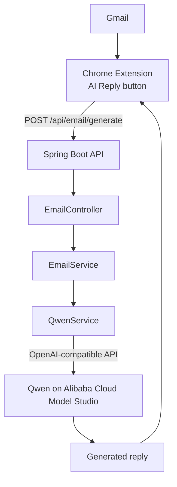

# AI Email Assistant

Generate Gmail replies in one click. A Chrome extension sends the email you're reading, plus a tone or custom instruction, to a Spring Boot backend, which asks Qwen to write the reply.

> **Status:** The backend is working and tested. The Chrome extension is the next milestone and is not built yet. See the [Roadmap](#roadmap).

---

## Why this project exists

Replying to email is repetitive. Most replies follow a pattern ("confirm the meeting," "politely decline," "ask for more details"), but writing each one still takes time. This project puts an AI assistant inside Gmail so the user can describe the reply they want and get a draft instantly.

## Demo

**Email received**

> Hi, can we schedule a meeting for tomorrow?

**Instruction**

> Write a professional reply.

**Generated reply**

> Hi, tomorrow works for me. Please let me know what time works best for you.

---

## How it works



1. The user opens an email in Gmail and clicks **AI Reply**.
2. The extension sends the email text and the user's instruction to the backend.
3. The backend validates the request and builds a prompt.
4. Qwen generates the reply and the backend returns it.
5. The extension inserts the reply into Gmail's compose box.

Steps 1, 2, and 5 are planned. Steps 3 and 4 are implemented today.

---

## Tech stack

| Layer | Technology |
|---|---|
| Backend | Java 21, Spring Boot, Spring Web, Bean Validation, Maven |
| AI | Qwen via Alibaba Cloud Model Studio (OpenAI-compatible API) |
| Frontend (planned) | Chrome Extension, JavaScript, HTML, CSS |
| Tooling | Git, GitHub |

---

## Project structure

```text
src/main/java/com/inimai/ai_email_assistant
├── controller
│   └── EmailController.java      # REST endpoint
├── service
│   ├── EmailService.java         # Business logic and prompt building
│   └── QwenService.java          # Qwen API client
├── dtos
│   └── EmailGenerateRequest.java # Validated request body
└── AiEmailAssistantApplication.java
```

The code is split into three layers: the **controller** handles HTTP, the **service** holds the logic, and the **AI client** is isolated in its own class, so the model provider can be swapped without touching the rest of the app.

---

## Roadmap

**Backend**
- [x] Spring Boot project setup
- [x] `POST /api/email/generate` endpoint
- [x] Request DTO with validation
- [x] Service layer and Qwen integration
- [x] Environment-based API key configuration
- [x] End-to-end request flow tested
- [ ] Error handling and retry strategy
- [ ] Rate limiting
- [ ] Logging and monitoring

**AI**
- [x] Qwen API integration
- [ ] Improved prompt design
- [ ] Preset tones (professional, friendly, short, firm)
- [ ] Context-aware replies for long email threads

**Chrome extension**
- [ ] Detect an open email in Gmail
- [ ] **AI Reply** button
- [ ] Tone picker and custom instruction input
- [ ] Connect to the backend
- [ ] Insert the reply into the compose box
- [ ] Loading and error states
- [ ] Edit the reply before inserting

**Deployment**
- [ ] Deploy the backend
- [ ] Publish the extension

## Author

**Inimai S**, [GitHub](https://github.com/inimai09)
